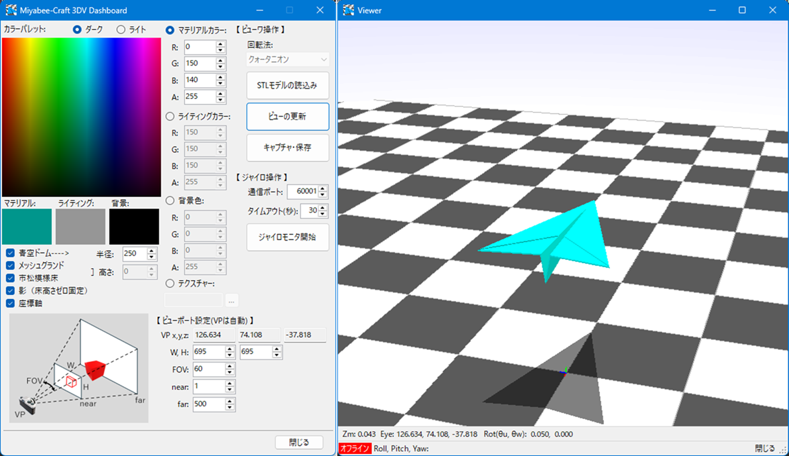

# Gyro3dMonitor

このアプリケーションは、**Raspberry Pi からジャイロセンサー MPU6050 のセンサー情報を受信し、3Dモデルの姿勢に反映してリアルタイムで表示する Windows アプリケーション**です。  
3Dモデルは STL ファイルとして読み込むことができ、お好みのモデルを自由に表示させることが可能です。
また、表示言語を選択可能です。対応言語は、日本語、英語、スペイン語、韓国語です。

---

## 💻 動作環境

- Windows 10 / 11
- Visual Studio 2022
- .NET 8.0（※）

> ※ `OpenTK` パッケージの使用においては `.NET Framework 4.6.1` 以上が推奨されていますが、  
> 本アプリでは `Json` 処理のため `.NET 8.0` を使用しています。  
> NuGet パッケージ経由で `Json` 関連を使用する場合、一部コードの修正で他のバージョンにも対応可能です。

---

## 📦 使用NuGetパッケージ

- [OpenTK](https://www.nuget.org/packages/OpenTK) 3.3.3  
- [OpenTK.GLControl](https://www.nuget.org/packages/OpenTK.GLControl) 3.3.3  
- [SurfaceAnalyzer](https://www.nuget.org/packages/SurfaceAnalyzer) 1.4.0  
- [OpenCvSharp4](https://www.nuget.org/packages/OpenCvSharp4) 4.10.0.20241108  

---

## 🚀 実行方法

1. このリポジトリをクローン：
   git bash
   git clone https://github.com/miyabee-craft/Gyro3dMonitor.git
2. Visual Studio で `Gyro3dMonitor.sln` ファイルを開く  
3. 必要な NuGet パッケージをインストール  
4. `F5` キーでデバッグ実行  

---

## 🧭 アプリケーションの使い方

以下のブログを参照してください：  
👉 [https://miyabee-craft.com/blog/2025/04/14/post-10254/](https://miyabee-craft.com/blog/2025/04/14/post-10254/)

Raspberry Pi 側のジャイロセンサー情報の送信方法はこちら：  
👉 [https://miyabee-craft.com/blog/2025/03/17/post-10206/](https://miyabee-craft.com/blog/2025/03/17/post-10206/)

---

## 📸 スクリーンショット

---

## 📄 ライセンス

このソフトは MIT ライセンスのもとで公開しています。
詳細は [LICENSE](./LICENSE.txt) ファイルをご確認ください。
