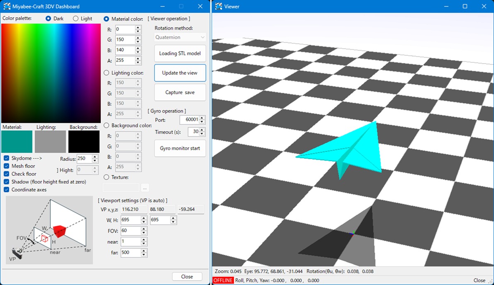

# Gyro3dMonitor

This application is a **Windows program that receives sensor data from the MPU6050 gyroscope connected to a Raspberry Pi, reflects it in the posture of a 3D model, and displays it in real time**.  
The 3D model can be loaded from an STL file, allowing you to freely choose and display your favorite models.
The display language is also supported: Japanese, English, Spanish, and Korean.

---

## 💻 System Requirements

- Windows 10 / 11  
- Visual Studio 2022  
- .NET 8.0 (*see note below*)

> *Note:* Although the `OpenTK` package is recommended for use with `.NET Framework 4.6.1` or later,  
> this application uses `.NET 8.0` for handling JSON data.  
> If you use JSON-related features via NuGet packages, you may be able to use other frameworks, but some code modifications might be required.

---

## 📦 NuGet Packages Used

- [OpenTK](https://www.nuget.org/packages/OpenTK) 3.3.3  
- [OpenTK.GLControl](https://www.nuget.org/packages/OpenTK.GLControl) 3.3.3  
- [SurfaceAnalyzer](https://www.nuget.org/packages/SurfaceAnalyzer) 1.4.0  
- [OpenCvSharp4](https://www.nuget.org/packages/OpenCvSharp4) 4.10.0.20241108  

---

## 🚀 How to Run

1. Clone this repository:
   git bash
   git clone https://github.com/miyabee-craft/Gyro3dMonitor.git
2. Open `Gyro3dMonitor.sln` with Visual Studio
3. Install the required NuGet packages
4. Press `F5` to build and run in debug mode

---

## 🧭 How to Use

Please refer to the following blog post for instructions:
👉 [https://miyabee-craft.com/blog/2025/04/14/post-10254/](https://miyabee-craft.com/blog/2025/04/14/post-10254/)

For information on how to send gyroscope data from the Raspberry Pi:
👉 [https://miyabee-craft.com/blog/2025/03/17/post-10206/](https://miyabee-craft.com/blog/2025/03/17/post-10206/)

---

## 📸 Screenshots

---

## 📄 License

This software is released under the MIT License.
Please see the [LICENSE](./LICENSE.txt) file for details.
